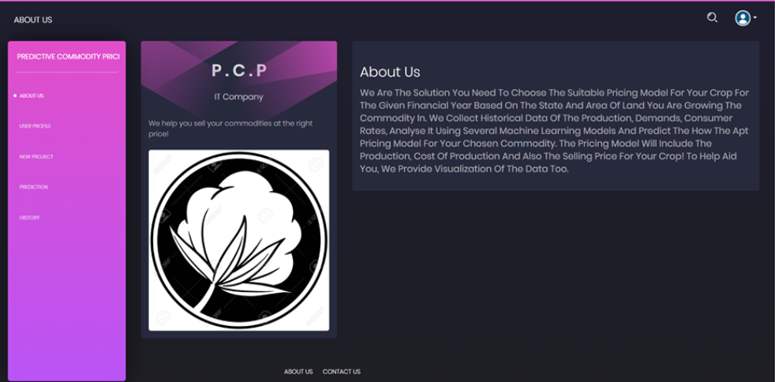
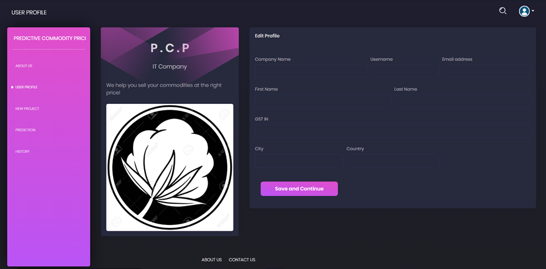
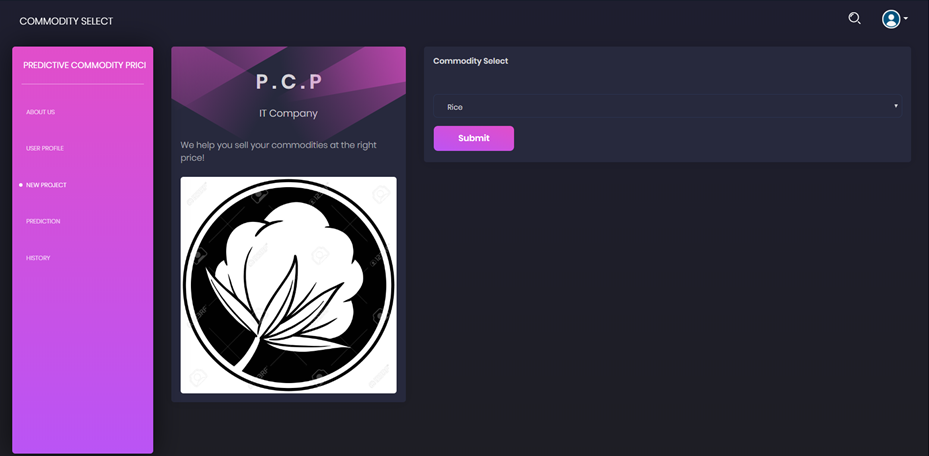
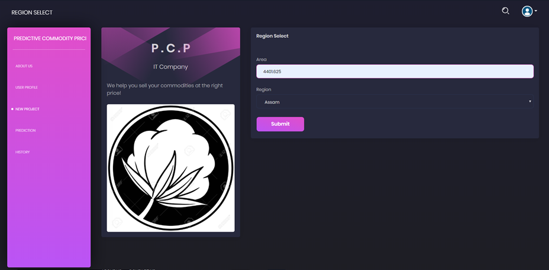
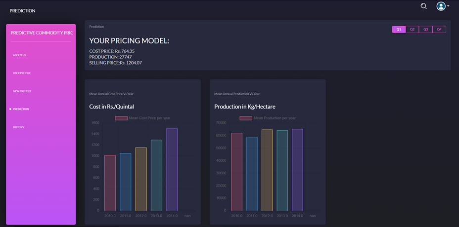
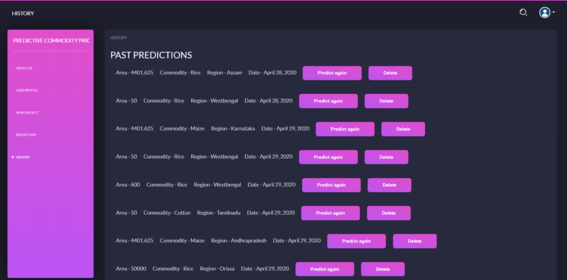

# FarmHelp
To provide an accurate and an apt pricing model for a particular commodity to the user using different machine learning algorithms.

<h2>Introduction</h2>
In our mini project, FarmHelp allows the user of our application to obtain an accurate and an apt pricing model for a particular commodity. The backend of our website is done using Django. Currently we have the availability of three commodities:
1.	Cotton
2.	Rice
3.	Maize
We have collected historical data of all three of these commodities in different states of India and then applied various Machine Learning algorithms to provide the pricing model for our user.

The user is initially asked the commodity he needs the pricing model for, after which the input of State of which the pricing model is required and the area of the land in which the commodity is going to be grown is asked from the user.The input of all these have been taken using Django Forms.Each state has a different pricing because the various factors on which the model depends varies with every state.At the moment, the states available for each commodity is:
1.	Cotton: 
•	Tamil Nadu  
•	Maharashtra 
•	Karnataka 
2.	Rice:  
•	Assam 
•	Uttar Pradesh  
•	West Bengal 
•	Orissa 
•	Madhya Pradesh  
3.	Maize: 
•	Andhra Pradesh  
•	Bihar 
•	Gujarat  
•	Karnataka 
•	Tamil Nadu 
•	Uttar Pradesh 
After these inputs are taken from the user, the machine learning models run and provide the pricing model. For the machine learning models, we divided the models into three phases:

The First Phase: The first phase predicts the productivity of the commodity. The features/variables for this model are ‘Area’, ‘Rainfall’, ‘Temperature’, ‘Crop Year’. For each state, we accumulated the data for each variable and ran several regressions as mentioned in the abstract i.e Linear Regression, Multiple Linear Regression, Polynomail Regression and Support Vector Regression and used the one with the best accuracy. 

The Second Phase: After receiving the value of productivity, we then predict the value of the cost price using a regression from above-mentioned options. We have specifically used this because cost price depends on productivity.

The Third Phase: The final phase is where the selling price is predicted. The cost price obtained from the second phase is used along with Consumer Price Index(CPI) and Consumption Rate as variables for this regression model. 

After this, all the values are depicted to our user and the visualization of 
Mean Production/Year and Mean Cost Price/Year using charts.js are also shown. The history of prices that have been predicted by the user can also be viewed by him. We have implemented the history page using models feature of Django. One object is created which consists of the attributes ‘Area’, ‘Commodity’, ‘State’, ‘Date’, ‘IDN’, where IDN is the primary key and this is stored in the database and then if the user requests to view the same prediction again, the values are fetched from the database, the model is run again and the pricing model is viewed. There is also a button to delete history, wherein this row gets deleted from our database. 
The model which stores the objects of the ‘History’ tab can be accessed through the Django Admin too.The user can create new objects for the model using the Admin feature of Django.
<h2>Screenshots</h2>

